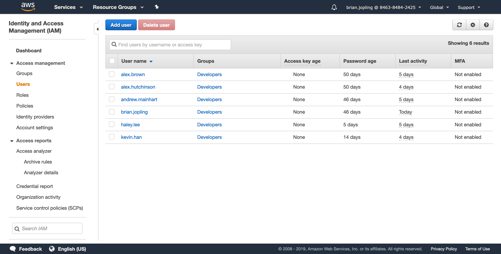
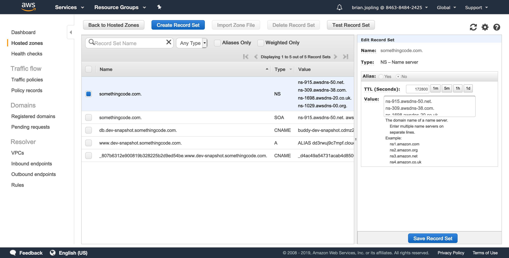
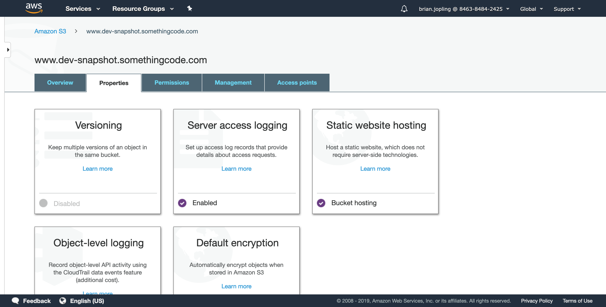
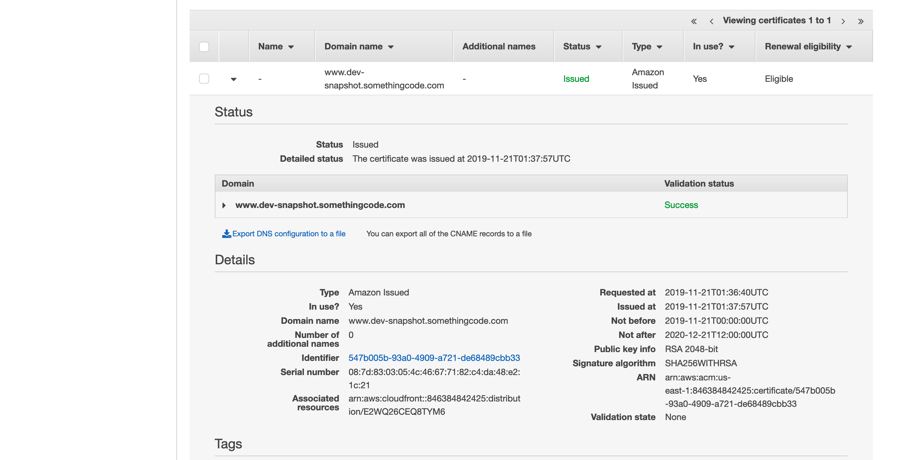
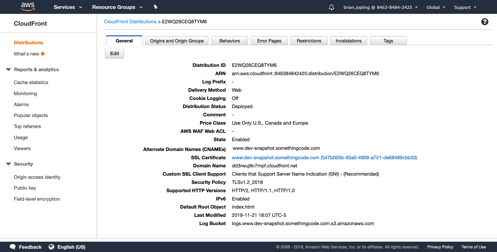
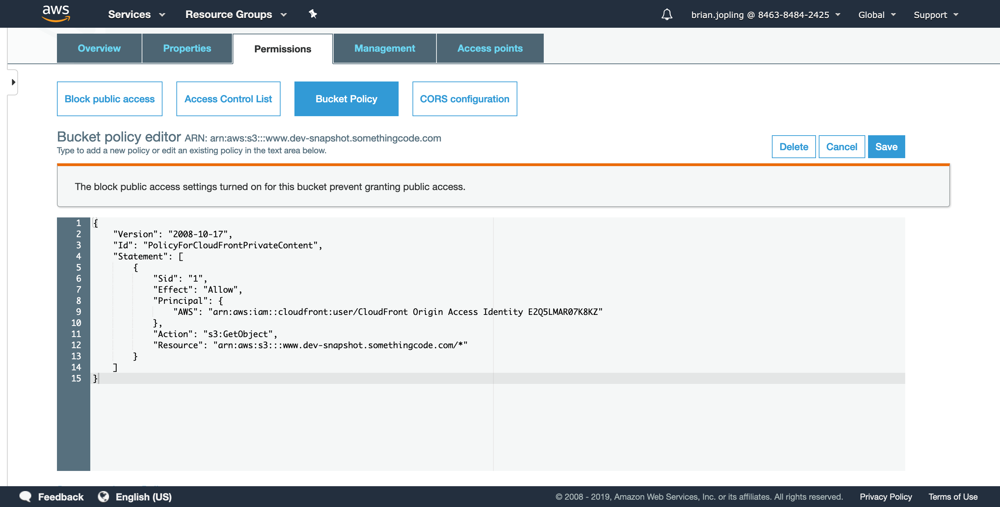
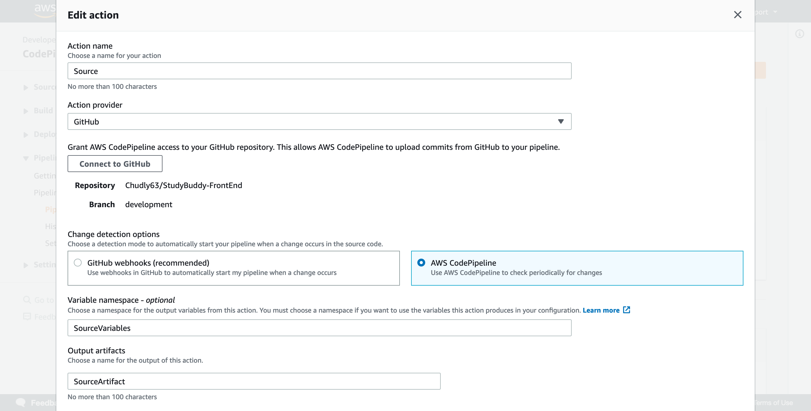
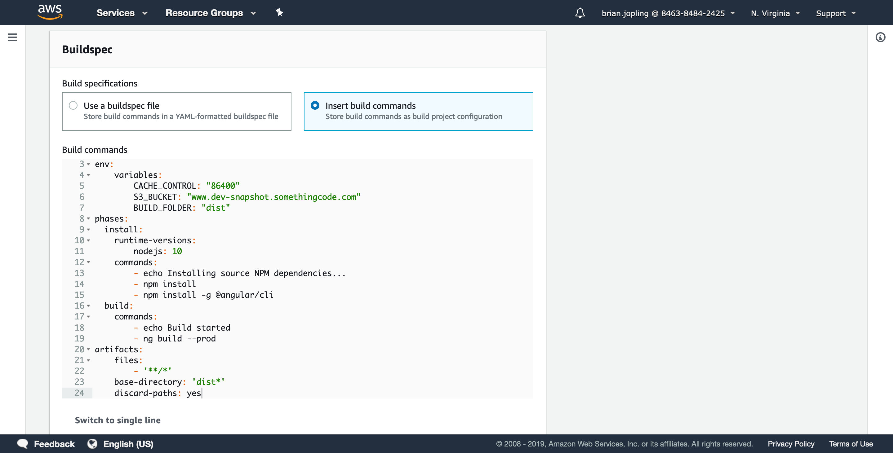
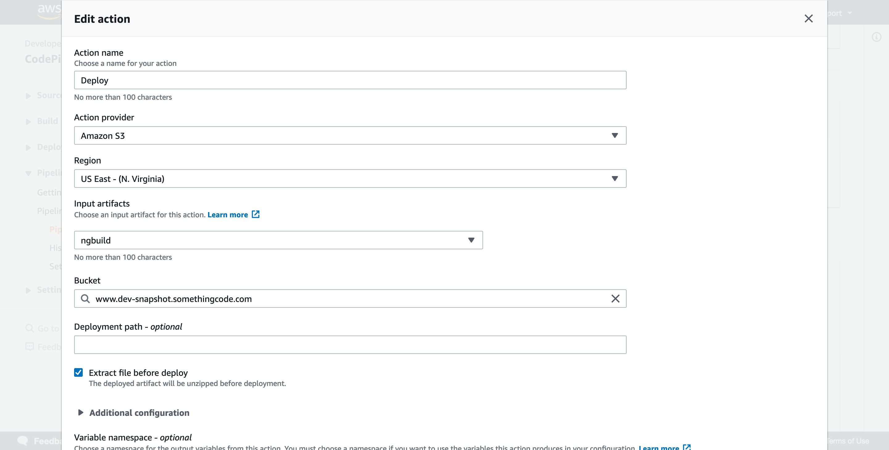
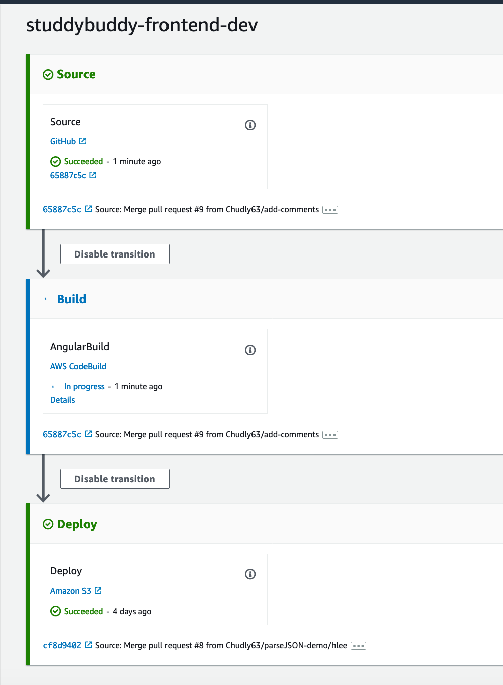

# Study Buddy Infrastructure

Brian Jopling, 2019

## Purpose

The purpose of this repository is to contain all infrastructure-related 
code for the Study Buddy project.

This repository contains or shall contain the following:

1. Infrastructure as Code (via CloudFormation templates)
2. CodePipeline configuration scripts
3. Ansillary infra supporting scripts

## CI-491 Summary

This quarter was all about the initial setup.
Most work was done manually via the Web Console.
For CI-492 and CI-493, there will be a focus on automating the steps 
that were done manually in CI-491, creating Infrastructure as Code to promote 
modularity and consistency. However, for now, we will describe what the manual 
steps entailed:

### AWS Account Administration

At the beginning of the quarter, an AWS account was created.
A root account was created with a strong password backed by MFA.

Individual IAM users were created for each member of Study Buddy.
Access for each user was restricted for development purposes only; users were 
not given Administrator or Billing level privileges.
A password policy was set for the IAM users, enforcing strong, secure 
passwords.

A basic billing notifier was setup, emailing the account owner (Brian) 
every day of the amount spent this month.

In Route 53 (AWS's Domain Name System), a hosted zone was purchased for 
somethingcode.com.

### Web-Host Server

An S3 bucket was created, with encryption at rest enabled, and was configured 
to act as a Static Web Host server.

An ACM (Amazon Certificate Manager) certificate was generated with a Subject Name 
corresponding to our dev URL. This will act as our TLS certificate. Since S3 
doesn't allow TLS certificates for custom domain names, a CDN or proxy would 
need to front the S3 Bucket. We chose a CDN since it would improve load time.

A CloudFront distribution (a CDN) was created to front the S3 Bucket. The 
CloudFront distribution was configured to use the ACM certificate created 
earlier as a means of implementing TLS.

A subdomain in Route 53 was registered to point to the CloudFront distribution.

The S3 Bucket was configured to only accept requests through CloudFront,
preventing users from accessing our site without https.

### Front-end CICD Pipeline

A CodePipeline (AWS's proprietary CICD Pipeline) was created.

A "Source" stage was created as the first phase of the pipeline.
This stage will poll for changes in the GitHub repo for the frontend
on the `development` branch.
When a change is found, this stage will zip the code and store it in a 
new S3 bucket temporarily. 

A "Build" stage is invoked after the Source stage is finished. The Build
stage begins by reading in the zipped code created by the Source stage.
The Build stage will unzip the code and run a bash script (`CodePipeline/frontend/buildspec.yaml`)
to build the Angular project (the frontend). The Build stage will pass the 
outputted artifacts to the next stage: Deploy.

The "Deploy" stage takes the outputted artifacts and simply drops them in the 
web-hosting S3 bucket.

### Back-end CICD Pipeline 

Work on the Back-end CICD Pipeline has been started, but is currently a WIP.
Screenshots and steps will be added as they are worked on.